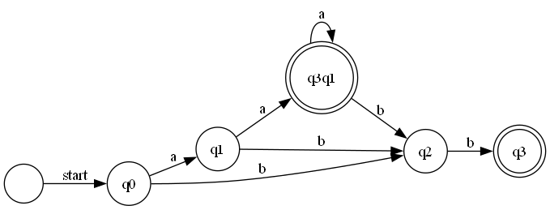

# **Determinism in Finite Automata: NDFA to DFA Conversion**

### **Course**: Formal Languages & Finite Automata

### **Author**: Alexandru Rudoi

📑 **[👉 Read the Full Report](https://github.com/AlexandruRudoi/LFA_Labs/blob/Lab_2/REPORT.md)**

---

## **Overview**

This project explores the conversion of **non-deterministic finite automata (NDFA)** into **deterministic finite automata (DFA)** while classifying a given grammar based on the **Chomsky hierarchy**. The key components include:

- **Grammar Classification**: Categorizing grammars into Chomsky’s four types.
- **NDFA Implementation**: Representing states, transitions, and final states.
- **NDFA to DFA Conversion**: Applying state transformation techniques.
- **Graphical Representation**: Visualizing the DFA using Graphviz.

---

## **Objectives**

- Implement a **Grammar class** that classifies grammars based on Chomsky’s hierarchy.
- Develop a **FiniteAutomaton class** to model deterministic and non-deterministic finite automata.
- Convert **an NDFA into a DFA** while ensuring correctness.
- Generate a **graphical representation of the DFA** using DOT notation and Graphviz.

---

## **Implementation Details**

### **Grammar Representation**

The grammar is defined as:

```
S → aA  | bB
A → bS  | cA  | aB
B → aB  | b
```

- **Non-terminals (VN)**: `{S, A, B}`
- **Terminals (VT)**: `{a, b, c}`
- **Productions (P)**: Defined as per the rules above.
- **Start Symbol (S)**: `S`

### **Finite Automaton Implementation**

The **FiniteAutomaton class** models an automaton using:

- **States (Q)**: `{q0, q1, q2, q3}`
- **Alphabet (Σ)**: `{a, b}`
- **Transitions (δ)**:
  ```
  δ(q0, a) -> q1
  δ(q0, b) -> q2
  δ(q1, a) -> q3, q1
  δ(q1, b) -> q2
  δ(q2, b) -> q3
  ```
- **Start State (q₀)**: `q0`
- **Final States (F)**: `{q3}`

### **NDFA to DFA Conversion**

The conversion process follows these steps:

1. **Initialize** the DFA with the NDFA’s start state.
2. **Process composite states** formed by merging multiple NDFA states.
3. **Rename states** using alphabetical labels (A, B, C, etc.) for clarity.
4. **Ensure determinism** by eliminating non-deterministic transitions.

### **Graphical Representation**

- The DFA is converted to **DOT format**.
- **Graphviz** processes the DOT file to generate a **PNG image**.
- The resulting graph visually represents states and transitions.

---

## **Execution Results**

### **Generated Strings:**

```
aab
bab
babb
acb
ba
```

### **String Validation:**

```
aab belongs to the language? True
bab belongs to the language? True
babb belongs to the language? True
acb belongs to the language? True
ba belongs to the language? True
```

### **DFA Representation:**

```
DFA States: q0, q1, q2, q3q1, q3
DFA Transitions:
δ(q0, a) -> { q1 }
δ(q0, b) -> { q2 }
δ(q1, a) -> { q3q1 }
δ(q1, b) -> { q2 }
δ(q2, b) -> { q3 }
δ(q3q1, a) -> { q3q1 }
δ(q3q1, b) -> { q2 }
DFA Start State: q0
DFA Final States: q3q1, q3
```

### **DFA Graph Output:**



---

## **How to Run the Project**

### **Prerequisites:**

- **.NET 9 SDK** installed.
- **Graphviz** installed for graphical visualization.

### **Clone the Repository:**

```sh
git clone https://github.com/AlexandruRudoi/LFA_Labs.git
cd LFA_Labs
```

### **Run the Program:**

```sh
dotnet run --project Lab_2/Lab_2.Application
```

### **Generate the DFA Graph:**

Ensure Graphviz is installed, then:

```sh
dot -Tpng DFA.dot -o DFA.png
```

### **Run Tests:**

```sh
dotnet test
```

---

## **Conclusion**

This project provided a hands-on approach to understanding **finite automata** and **grammar classification**. The transformation from **NDFA to DFA** was successfully implemented and validated. Additionally, the graphical representation of the DFA states and transitions further reinforced the theoretical concepts of **deterministic finite automata**.

---

## **References**

- **Michael Sipser** – Introduction to the Theory of Computation.
- **Formal Language & Automata Theory** – Course Materials.
- **C# .NET 9 Documentation** – [docs.microsoft.com](https://docs.microsoft.com/en-us/dotnet/)
