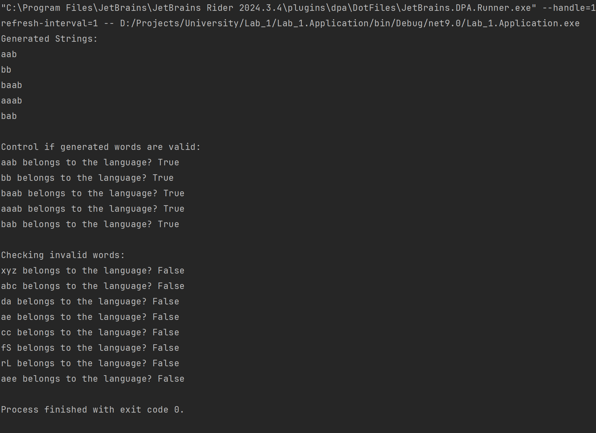

# **Grammar to Finite Automaton Conversion**

### **Course**: Formal Languages & Finite Automata

### **Author**: Alexandru Rudoi

---

## **Theory**

In formal language theory, a **grammar** is a set of rules that define how strings in a language are formed. It consists of:

- **VN (Non-terminals)**: Symbols that can be replaced by production rules.
- **VT (Terminals)**: The actual characters of the language.
- **P (Productions)**: Rules that define how non-terminals transform into other symbols.
- **S (Start symbol)**: The initial symbol from which derivations begin.

A **Finite Automaton (FA)** is a computational model used to recognize patterns and determine whether a given string belongs to a language. It consists of:

- **Q (States)**
- **Σ (Alphabet)**
- **δ (Transition function)**
- **q₀ (Start state)**
- **F (Final states)**

The goal of this project is to implement a **Grammar to Finite Automaton conversion** and validate string membership using **.NET 9**.

---

## **Objectives**

- Implement a **Grammar class** that:

  - Stores **VN, VT, P, and S**.
  - Generates **valid strings** based on the production rules.
  - Converts itself into a **Finite Automaton**.

- Implement a **FiniteAutomaton class** that:

  - Represents states, alphabet, and transitions.
  - Checks if a given string is **valid** based on the automaton's rules.

- Validate the implementation by:
  - Generating **5 valid strings**.
  - Checking both **valid** and **invalid** strings against the automaton.

---

## **Implementation Description**

Our project consists of three key parts:

### **1️⃣ `Grammar` Class**

This class defines the **formal grammar** based on:

- **Non-terminals**: `{S, A, B}`
- **Terminals**: `{a, b, c}`
- **Production rules**:
  ```
  S → aA
  S → bB
  A → bS
  A → cA
  A → aB
  B → aB
  B → b
  ```
- The `GenerateStrings()` function **recursively** produces 5 valid words.

#### **Code snippet for string generation:**

```csharp
public List<string> GenerateStrings(int count = 5)
{
    List<string> generatedStrings = new List<string>();

    for (int i = 0; i < count; i++)
    {
        string generatedWord = GenerateWord(StartSymbol);
        generatedStrings.Add(generatedWord);
    }

    return generatedStrings;
}
```

---

### **2️⃣ `FiniteAutomaton` Class**

This class represents a **finite automaton** that is generated from our grammar. It:

- Converts the grammar into **states and transitions**.
- Stores **transition functions** in a structured dictionary.
- Implements `StringBelongsToLanguage()` to check if a string is valid.

#### **Code snippet for transition logic:**

```csharp
public bool StringBelongsToLanguage(string inputString)
{
    HashSet<string> currentStates = new() { StartState };

    foreach (char c in inputString)
    {
        HashSet<string> nextStates = new();
        foreach (string state in currentStates)
        {
            if (Transitions.ContainsKey(state) && Transitions[state].ContainsKey(c.ToString()))
                nextStates.UnionWith(Transitions[state][c.ToString()]);
        }

        if (!nextStates.Any())
            return false; // No valid transitions

        currentStates = nextStates;
    }

    return currentStates.Any(state => FinalStates.Contains(state));
}
```

---

### **3️⃣ `Main` Execution**

Our `Main` function:

- Creates a grammar instance.
- Generates 5 valid strings.
- Converts the grammar into an automaton.
- Checks **valid & invalid strings**.

#### **Code snippet for testing valid words:**

```csharp
Console.WriteLine("\nControl if generated words are valid:");
foreach (string word in generatedWords)
{
    Console.WriteLine($"{word} belongs to the language? {fa.StringBelongsToLanguage(word)}");
}
```

---

## **Conclusions / Screenshots / Results**

I conclusion, this lab deepened my understanding of formal grammars and finite automata by requiring me to translate theoretical concepts into a functional model. Implementing the conversion from grammar to automaton and validating string membership helped me grasp how languages are structured and processed. Initially, I experimented with a Python version but found myself more engaged in C#, where working with structured data and transitions felt more intuitive and aligned with my problem-solving approach.

### **Example Outputs:**

**Console Output I:**
```
Generated Strings:
ab
bab
babb
acb
ba

Control if generated words are valid:
ab belongs to the language? True
bab belongs to the language? True
babb belongs to the language? True
acb belongs to the language? True
ba belongs to the language? True

Checking invalid words:
xyz belongs to the language? False
abc belongs to the language? False
da belongs to the language? False
ae belongs to the language? False
cc belongs to the language? False

```
## Results

Below is a screenshot of the program execution:



---

## **References**

- **Michael Sipser** – Introduction to the Theory of Computation.
- Formal Language & Automata Theory – Course Materials.
- C# .NET 9 Documentation ([docs.microsoft.com](https://docs.microsoft.com/en-us/dotnet/))
