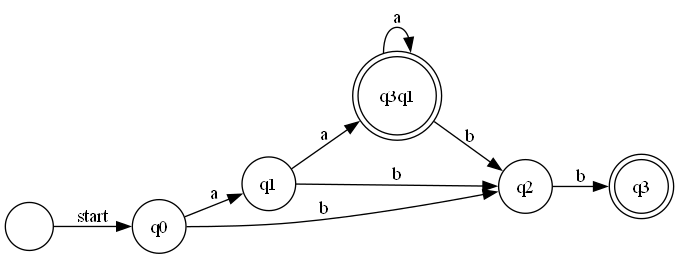

# **Determinism in Finite Automata. Conversion from NDFA to DFA. Chomsky Hierarchy**

### **Course**: Formal Languages & Finite Automata

### **Author**: Alexandru Rudoi

---

## **Theory**

In formal language theory, a **finite automaton** is a computational model used to recognize patterns and determine whether a given string belongs to a language. A finite automaton consists of states, transitions, and a defined set of rules governing how it processes input strings. The key components include:

I. **Q (States)** - A finite set of states.
II. **Σ (Alphabet)** - A finite set of symbols representing the input.
III. **δ (Transition function)** - Defines the state transitions based on input symbols.
IV. **q₀ (Start state)** - The initial state from which computation begins.
V. **F (Final states)** - A set of states that indicate acceptance of an input string.

A finite automaton can be either **deterministic (DFA)** or **non-deterministic (NDFA)**. The key difference between the two lies in the transition function. In a DFA, for each state and input symbol, there is exactly one transition, making it predictable. In contrast, an NDFA allows multiple possible transitions for a given state and input symbol, introducing non-determinism.

In addition to finite automata, grammars define how strings in a language are formed. A **grammar** consists of:

I. **VN (Non-terminals)** - Symbols that can be replaced using production rules.
II. **VT (Terminals)** - The actual symbols of the language.
III. **P (Productions)** - A set of rules that describe how non-terminals transform into other symbols.
IV. **S (Start symbol)** - The initial symbol from which derivations begin.

According to the **Chomsky hierarchy**, grammars are classified into four types:

1. **Type 0 (Unrestricted Grammar)** - No restrictions on production rules.
2. **Type 1 (Context-Sensitive Grammar)** - Productions must not decrease string length.
3. **Type 2 (Context-Free Grammar)** - The left-hand side of a production contains a single non-terminal.
4. **Type 3 (Regular Grammar)** - Productions follow strict linear rules and correspond to finite automata.

---

## **Objectives**

The primary goal of this lab was to analyze finite automata and convert an NDFA into a DFA while classifying a given grammar within the Chomsky hierarchy. Specifically, the tasks involved:

I. Implementing a **Grammar class** capable of classifying grammars based on the Chomsky hierarchy.
II. Developing a **FiniteAutomaton class** to represent and validate automata operations.
III. Implementing the **conversion of an NDFA to a DFA** and verifying determinism.
IV. Graphically representing the DFA through DOT visualization.

---

## **Implementation Description**

The implementation consists of three main components: **Grammar**, **Finite Automaton**, and **Determinization**.

### **Grammar Implementation**

The **Grammar class** stores non-terminals, terminals, production rules, and a start symbol. The `ClassifyGrammar` method evaluates the structure of production rules to determine the grammar type based on the Chomsky hierarchy. Additionally, the `GenerateStrings` method recursively produces valid strings by applying production rules.

### **Finite Automaton Implementation**

The **FiniteAutomaton class** represents a finite automaton, storing states, the alphabet, transitions, and final states. The `StringBelongsToLanguage` method verifies whether a given input string is accepted by the automaton. This is done by iterating through each symbol in the input string and checking valid transitions between states.

### **NDFA to DFA Conversion**

The **ConvertToDFA** method constructs a deterministic finite automaton by grouping NDFA states into composite states. This process involves:

1. Initializing the DFA with a state derived from the NDFA start state.
2. Iteratively processing states, merging possible transitions.
3. Assigning unique names to new composite states.
4. Marking states as final if any of their components belong to the original final states.

The DFA is then **renamed** using alphabetical labels (A, B, C, etc.) for clarity.

### **Graphical Representation**

To visualize the DFA, a **ToDot** function generates a DOT format representation of the automaton. This DOT file is processed using Graphviz to create a PNG image, providing a clear graphical depiction of the DFA states and transitions.

---

## **Results and Analysis**

The implemented system correctly classifies the given grammar within the Chomsky hierarchy. The NDFA-to-DFA conversion produces a valid deterministic automaton, and the DFA graph is successfully generated in DOT format and exported as a PNG image.

### **Example Outputs**

**Generated Strings:**

```
aab
bab
babb
acb
ba
```

**String Validation:**

```
aab belongs to the language? True
bab belongs to the language? True
babb belongs to the language? True
acb belongs to the language? True
ba belongs to the language? True
```

**Grammar Classification:**

```
Grammar classification: Type 3: Regular Grammar
```

**DFA Representation:**

```
DFA States: q0, q1, q2, q3q1, q3
DFA Transitions:
δ(q0, a) -> { q1 }
δ(q0, b) -> { q2 }
δ(q1, a) -> { q3q1 }
δ(q1, b) -> { q2 }
δ(q2, b) -> { q3 }
δ(q3q1, a) -> { q3q1 }
δ(q3q1, b) -> { q2 }
DFA Start State: q0
DFA Final States: q3q1, q3
```

**DFA Graph Output:**


The graphical representation of the DFA successfully illustrates state transitions and final states. The transformation from NDFA to DFA ensures all states are deterministic, improving computational efficiency.

---

## **Conclusions**

This laboratory work provided valuable insights into the concepts of determinism in finite automata and the process of converting an NDFA into a DFA. By implementing a structured approach to grammar classification and automaton determinization, the project demonstrated the practical applications of formal language theory in computational models. The graphical representation of the DFA further enhanced the understanding of state transitions and finite automaton structure.

This implementation successfully validated the correctness of the conversion algorithm and provided a systematic approach to analyzing finite automata within the Chomsky hierarchy.

---

## **References**

- **Michael Sipser** – Introduction to the Theory of Computation.
- Formal Language & Automata Theory – Course Materials.
- C# .NET 9 Documentation ([docs.microsoft.com](https://docs.microsoft.com/en-us/dotnet/))
